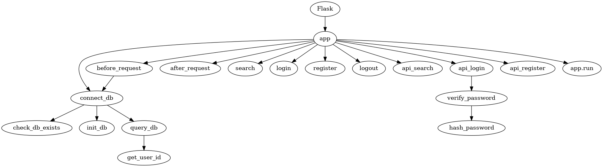

# Mandatory I - Ali and Brian


**Dependency Graph**

**Problems with the codebase**

**Branching Streategy**

**OpenAPI Specification**

---

## Dependency Graph
```sh
digraph G {
    # Core Dependencies
    "Flask" -> "app"

    # Database Functions
    "app" -> "connect_db"
    "connect_db" -> "check_db_exists"
    "connect_db" -> "init_db"
    "connect_db" -> "query_db"
    "query_db" -> "get_user_id"

    # Request Lifecycle
    "app" -> "before_request"
    "before_request" -> "connect_db"
    "app" -> "after_request"

    # Page Routes
    "app" -> "search"
    "app" -> "login"
    "app" -> "register"
    "app" -> "logout"
 
    # API Routes
    "app" -> "api_search"
    "app" -> "api_login"
    "app" -> "api_register"
 
    # Security Functions
    "api_login" -> "verify_password"
    "verify_password" -> "hash_password"

    # Main
    "app" -> "app.run"
}
```



---

## Problems with the codebase

1. **Risk of SQL-injections**
    * API is prone to SQL-injections. Should use parameterized queries.
        ```py
        user = query_db("SELECT * FROM users WHERE username = '%s'" % request.form['username'], one=True)
        ```

2. **Possibilty of Cross-Site Scripting (XSS) Attacks**
    * Special characters (such as <, >, ", and ') are no escaped on certain inputs, making it possible to run malicious scripts in the browser. Should be validated and sanitized.
    ```html
        <div>
            <input id="search-input" placeholder="Search..." value="{{ request.args.get('q', '') }}"/>
            <button onclick="makeSearchRequest()">Search</button>
        </div>
    ```

3. **Weak password hashing algorithm (MD5)**
    * API is using MD5 algorithm to encrypt passwords, but it is today deemed outdated and unsafe to use.
        ```py
        def hash_password(password):
            """Hash a password using md5 encryption."""
            password_bytes = password.encode('utf-8')
            hash_object = hashlib.md5(password_bytes)
            password_hash = hash_object.hexdigest()
            return password_hash
        ```

4. **Secret key is not secret**
    * Unsafe use of `secret_key` which the value is visible for all
        ```py
        SECRET_KEY = 'development key'
        app.secret_key = SECRET_KEY
        ```

5. **Too specific error messages in /api/login**
    * The api-server provides too specific error messages to users with malicious intent.
        ```py
        if user is None:
            error = 'Invalid username'
        elif not verify_password(user['password'], request.form['password']):
            error = 'Invalid password'
        ```


---

## Branching Strategy

We have agreed to use Github Flow combined with Feature Branching as our branching strategy. This approach helps our development process and promotes better collaboration in the team.

### Feature Branching

Feature branching is a strategy where each new feature, bug fix, or task is developed in a separate branch off our main branch. This method isolates changes until they are fully tested and approved. Each feature branch is named according to the feature being developed, for example, feature/login-functionality or fix/api-search-query.

This branching strategy provides several benefits:

- **Parallel Development**: Multiple developers can work on different features simultaneously without interfering with each other's code.

- **Code Isolation**: Changes in one branch do not affect others, ensuring that incomplete features do not disrupt the main branch.

- **Easy Rollback**: If a feature turns out to be problematic, it can be safely removed or rolled back without affecting the main codebase.

- **Task Organization**: It becomes easier to track the progress of individual tasks or issues, as each branch is linked to a specific GitHub issue.

### Github Flow

Github Flow is a workflow designed to manage the development process effectively. It is based on few simple rules:

- **Create a Feature Branch**: When starting work on a new feature or fix, create a new branch off main.

- **Commit Regularly**: Make regular commits to the branch, ensuring that each commit represents a logical unit of work.

- **Open a Pull Request (PR)**: Once the feature is complete, open a pull request to merge the changes back into the main branch.

- **Request Peer Review**: The pull request is reviewed by peers. During this stage, the code is checked for correctness, adherence to issue requirements. Github Flow’s emphasis on pull requests ensures that no code is merged without oversight.

- **Collaborate and Improve**: If the code is not satisfactory or requires changes, the reviewer and developer engage in a discussion directly within the PR. Suggestions are made, improvements are implemented, and additional commits are pushed until the changes are approved.

- **Merge into Main**: Once approved, the branch is merged into the main branch. Workflows which trigger on `pull_request` will run to validate the changes before the merge is finalized.

- **Delete the Branch**: After a successful merge, the feature branch is deleted to keep the repository clean.

### Benefits of this Strategy

By combining Github Flow and Feature Branching, we achieve the following advantages:

- **Enhanced Code Quality**: The enforced code review process helps us catch bugs early, ensures consistent coding styles, and helps knowledge sharing among us.

- **Transparency**: Every change is made visible to the team, allowing us to stay updated with ongoing developments.

- **Team Collaboration**: Pull requests act as a platform for us to discuss implementations, provide feedback, and suggest enhancements.

- **Reduced Merge Conflicts**: Since each branch focuses on a single feature, large and complex merge conflicts are minimized.

---


## OpenAPI Specification


Can also be found [here](./api_specification.json) as a file.

```json
{
  "openapi": "3.0.1",
  "info": {
    "title": "api",
    "version": "1.0"
  },
  "paths": {
    "/api/search": {
      "get": {
        "tags": [
          "Page"
        ],
        "parameters": [
          {
            "name": "q",
            "in": "query",
            "schema": {
              "type": "string"
            }
          },
          {
            "name": "language",
            "in": "query",
            "schema": {
              "type": "string",
              "default": "en"
            }
          }
        ],
        "responses": {
          "200": {
            "description": "Success",
            "content": {
              "text/plain": {
                "schema": {
                  "type": "array",
                  "items": {
                    "$ref": "#/components/schemas/PageResponseDto"
                  }
                }
              },
              "application/json": {
                "schema": {
                  "type": "array",
                  "items": {
                    "$ref": "#/components/schemas/PageResponseDto"
                  }
                }
              },
              "text/json": {
                "schema": {
                  "type": "array",
                  "items": {
                    "$ref": "#/components/schemas/PageResponseDto"
                  }
                }
              }
            }
          }
        }
      }
    },
    "/api/register": {
      "post": {
        "tags": [
          "User"
        ],
        "requestBody": {
          "content": {
            "application/json": {
              "schema": {
                "$ref": "#/components/schemas/RegisterRequestDto"
              }
            },
            "text/json": {
              "schema": {
                "$ref": "#/components/schemas/RegisterRequestDto"
              }
            },
            "application/*+json": {
              "schema": {
                "$ref": "#/components/schemas/RegisterRequestDto"
              }
            }
          }
        },
        "responses": {
          "200": {
            "description": "Success",
            "content": {
              "text/plain": {
                "schema": {
                  "$ref": "#/components/schemas/UserResponseDto"
                }
              },
              "application/json": {
                "schema": {
                  "$ref": "#/components/schemas/UserResponseDto"
                }
              },
              "text/json": {
                "schema": {
                  "$ref": "#/components/schemas/UserResponseDto"
                }
              }
            }
          }
        }
      }
    },
    "/api/login": {
      "post": {
        "tags": [
          "User"
        ],
        "requestBody": {
          "content": {
            "application/json": {
              "schema": {
                "$ref": "#/components/schemas/LoginRequestDto"
              }
            },
            "text/json": {
              "schema": {
                "$ref": "#/components/schemas/LoginRequestDto"
              }
            },
            "application/*+json": {
              "schema": {
                "$ref": "#/components/schemas/LoginRequestDto"
              }
            }
          }
        },
        "responses": {
          "200": {
            "description": "Success",
            "content": {
              "text/plain": {
                "schema": {
                  "$ref": "#/components/schemas/TokenUserResponseDto"
                }
              },
              "application/json": {
                "schema": {
                  "$ref": "#/components/schemas/TokenUserResponseDto"
                }
              },
              "text/json": {
                "schema": {
                  "$ref": "#/components/schemas/TokenUserResponseDto"
                }
              }
            }
          }
        }
      }
    },
    "/api/weather": {
      "get": {
        "tags": [
          "Weather"
        ],
        "responses": {
          "200": {
            "description": "Success"
          }
        }
      }
    }
  },
  "components": {
    "schemas": {
      "LoginRequestDto": {
        "type": "object",
        "properties": {
          "username": {
            "type": "string",
            "nullable": true
          },
          "password": {
            "type": "string",
            "nullable": true
          }
        },
        "additionalProperties": false
      },
      "PageResponseDto": {
        "type": "object",
        "properties": {
          "title": {
            "type": "string",
            "nullable": true
          },
          "url": {
            "type": "string",
            "nullable": true
          },
          "language": {
            "type": "string",
            "nullable": true
          },
          "content": {
            "type": "string",
            "nullable": true
          }
        },
        "additionalProperties": false
      },
      "RegisterRequestDto": {
        "type": "object",
        "properties": {
          "username": {
            "type": "string",
            "nullable": true
          },
          "email": {
            "type": "string",
            "nullable": true
          },
          "password": {
            "type": "string",
            "nullable": true
          },
          "password2": {
            "type": "string",
            "nullable": true
          }
        },
        "additionalProperties": false
      },
      "TokenUserResponseDto": {
        "type": "object",
        "properties": {
          "token": {
            "type": "string",
            "nullable": true
          },
          "user": {
            "$ref": "#/components/schemas/UserResponseDto"
          }
        },
        "additionalProperties": false
      },
      "UserResponseDto": {
        "type": "object",
        "properties": {
          "username": {
            "type": "string",
            "nullable": true
          },
          "email": {
            "type": "string",
            "nullable": true
          }
        },
        "additionalProperties": false
      }
    }
  }
}
```
---

### Made by Ali & Brian, 27/09/2024
